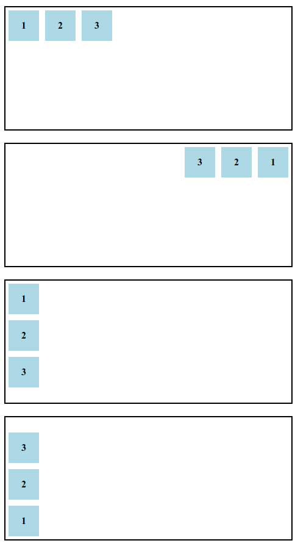
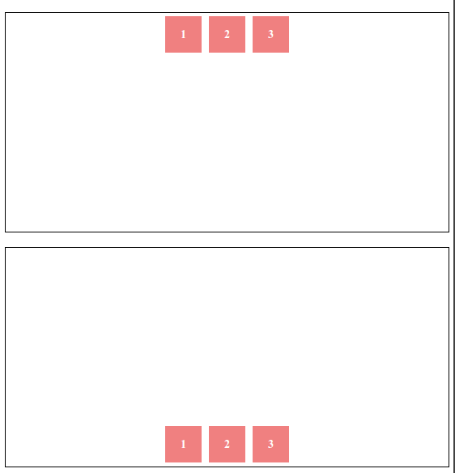
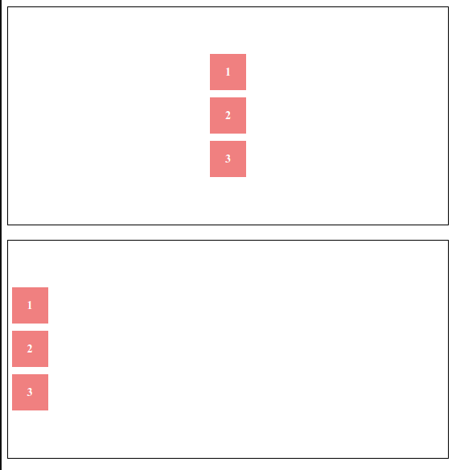
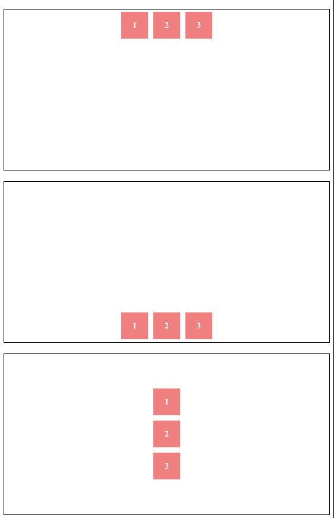

# Flexbox

Flexbox (abreviatura de Flexible Box) es un módulo de diseño en CSS diseñado para proporcionar una manera eficiente y sencilla de alinear y distribuir elementos en un contenedor, incluso si sus tamaños son dinámicos o desconocidos. Flexbox es especialmente útil para crear diseños responsivos y adaptables, lo que lo convierte en una herramienta fundamental para los desarrolladores web.

##  Razones para aprender Flexbox
* *Facilita diseños complejos*: Con Flexbox, es más fácil alinear elementos horizontal o verticalmente, incluso con distribuciones dinámicas.

* *Diseño adaptativo y moderno*: Es una herramienta clave para crear sitios web responsivos y modernos que funcionen en una variedad de dispositivos y tamaños de pantalla.

* *Mayor eficiencia*: Al simplificar el CSS necesario para diseños complejos, reduce el tiempo y esfuerzo en el desarrollo.

* *Compatibilidad amplia*: Aunque Flexbox no es la herramienta más nueva (como Grid), sigue siendo compatible con la mayoría de los navegadores modernos y es ampliamente utilizado en proyectos web actuales.

* *Fundamental para aprender CSS Grid*: Flexbox y CSS Grid se complementan. Dominar Flexbox prepara el camino para manejar CSS Grid y abordar diseños aún más avanzados.


# Eje principal y eje cruzado

Flexbox organiza elementos a lo largo de un eje principal y un eje cruzado, permitiendo un control preciso de la dirección, el espaciado y el alineamiento de los elementos hijos.

* Eje principal: definido por la propiedad flex-direction.
* Eje cruzado: perpendicular al eje principal.


## Uso de flex-direction en CSS
La propiedad `flex-direction` define la dirección del eje principal del contenedor flexible, determinando cómo se organizan los elementos hijos. Tiene cuatro valores principales:

* `row` (predeterminado): organiza los elementos de izquierda a derecha en una fila. Es el valor predeterminado de flex-direction.
* `row-reverse`: organiza los elementos de derecha a izquierda en una fila. 
* `column`: organiza los elementos de arriba hacia abajo en una columna.
* `column-reverse`: organiza los elementos de abajo hacia arriba en una columna.


https://developer.mozilla.org/en-US/docs/Web/CSS/flex-direction


### Ejemplo

```html
<!DOCTYPE html>
<html lang="en">
<head>
  <meta charset="UTF-8">
  <meta name="viewport" content="width=device-width, initial-scale=1.0">
  <title>Flexbox: flex-direction</title>
  <style>
    .container {
      display: flex;
      width: 100%;
      height: 200px;
      border: 2px solid black;
      margin-bottom: 20px;
    }

    .box {
      width: 50px;
      height: 50px;
      background-color: lightblue;
      margin: 5px;
      text-align: center;
      line-height: 50px;
      font-weight: bold;
    }

    .row {
      flex-direction: row;
    }

    .row-reverse {
      flex-direction: row-reverse;
    }

    .column {
      flex-direction: column;
    }

    .column-reverse {
      flex-direction: column-reverse;
    }
  </style>
</head>
<body>
  <h2>Flexbox: flex-direction</h2>

  <div class="container row">
    <div class="box">1</div>
    <div class="box">2</div>
    <div class="box">3</div>
  </div>

  <div class="container row-reverse">
    <div class="box">1</div>
    <div class="box">2</div>
    <div class="box">3</div>
  </div>

  <div class="container column">
    <div class="box">1</div>
    <div class="box">2</div>
    <div class="box">3</div>
  </div>

  <div class="container column-reverse">
    <div class="box">1</div>
    <div class="box">2</div>
    <div class="box">3</div>
  </div>
</body>
</html>
```





## Uso combinado de flex-direction (eje principal) y align-items (eje cruzado)
En un contenedor `display: flex`, el eje principal se controla con flex-direction, mientras que el eje cruzado (perpendicular al principal) se maneja con propiedades como align-items. Esto permite crear diseños flexibles en ambas direcciones.

Opciones de align-items
* `flex-start` (valor predeterminado):
Los elementos se alinean al inicio del eje cruzado.

* `flex-end`:
Los elementos se alinean al final del eje cruzado.

* `center`:
Los elementos se centran a lo largo del eje cruzado.

* `baseline`:
Los elementos se alinean en la línea base del texto contenido en cada uno de ellos.

* `stretch`:
Los elementos se estiran para llenar el espacio disponible a lo largo del eje cruzado (este es el valor predeterminado si no se especifica un tamaño para el elemento).


https://developer.mozilla.org/en-US/docs/Web/CSS/align-items


```html
<!DOCTYPE html>
<html lang="en">
<head>
  <meta charset="UTF-8">
  <meta name="viewport" content="width=device-width, initial-scale=1.0">
  <title>Flexbox: Ejes Principal y Cruzado</title>
  <style>
    .container {
      display: flex;
      width: 100%;
      height: 300px;
      border: 2px solid black;
      margin-bottom: 20px;
      justify-content: center; /* Centra los elementos en el eje principal */
    }

    .box {
      width: 50px;
      height: 50px;
      background-color: lightcoral;
      margin: 5px;
      text-align: center;
      line-height: 50px;
      font-weight: bold;
      color: white;
    }

    /* Ejemplo de ejes principal y cruzado combinados */
    .row-center {
      flex-direction: row;
      align-items: center; /* Centra los elementos en el eje cruzado */
    }

    .row-end {
      flex-direction: row;
      align-items: flex-end; /* Alinea los elementos en el borde inferior (eje cruzado) */
    }

    .column-center {
      flex-direction: column;
      align-items: center; /* Centra los elementos horizontalmente en el eje cruzado */
    }

    .column-stretch {
      flex-direction: column;
      align-items: stretch; /* Estira los elementos en el eje cruzado */
    }
  </style>
</head>
<body>
  <h2>Flexbox: Ejes Principal y Cruzado</h2>

  <div class="container row-center">
    <div class="box">1</div>
    <div class="box">2</div>
    <div class="box">3</div>
  </div>

  <div class="container row-end">
    <div class="box">1</div>
    <div class="box">2</div>
    <div class="box">3</div>
  </div>

  <div class="container column-center">
    <div class="box">1</div>
    <div class="box">2</div>
    <div class="box">3</div>
  </div>

  <div class="container column-stretch">
    <div class="box">1</div>
    <div class="box">2</div>
    <div class="box">3</div>
  </div>
</body>
</html>

```





```html
<!DOCTYPE html>
<html lang="en">
<head>
  <meta charset="UTF-8">
  <meta name="viewport" content="width=device-width, initial-scale=1.0">
  <title>Flexbox: align-items</title>
  <style>
    .container {
      display: flex;
      flex-direction: row; /* Eje principal horizontal */
      height: 200px;
      border: 2px solid black;
      margin-bottom: 20px;
    }

    .box {
      width: 50px;
      background-color: lightseagreen;
      color: white;
      margin: 5px;
      text-align: center;
      line-height: 30px;
      font-weight: bold;
    }

    /* Clases para los diferentes valores de align-items */
    .flex-start {
      align-items: flex-start;
    }

    .flex-end {
      align-items: flex-end;
    }

    .center {
      align-items: center;
    }

    .baseline {
      align-items: baseline;
    }

    .stretch {
      align-items: stretch;
    }
  </style>
</head>
<body>
  <h2>Flexbox: Opciones de align-items</h2>

  <div class="container flex-start">
    <div class="box">A</div>
    <div class="box">B</div>
    <div class="box" style="height: 60px;">C</div>
  </div>

  <div class="container flex-end">
    <div class="box">A</div>
    <div class="box">B</div>
    <div class="box" style="height: 60px;">C</div>
  </div>

  <div class="container center">
    <div class="box">A</div>
    <div class="box">B</div>
    <div class="box" style="height: 60px;">C</div>
  </div>

  <div class="container baseline">
    <div class="box">A</div>
    <div class="box">B</div>
    <div class="box" style="height: 60px;">C</div>
  </div>

  <div class="container stretch">
    <div class="box">A</div>
    <div class="box">B</div>
    <div class="box" style="height: 60px;">C</div>
  </div>
</body>
</html>

```





# Distribución del espacio

Permite controlar cómo los elementos ocupan espacio en el contenedor, con opciones como:

`justify-content`: para alinear elementos a lo largo del eje principal.
`align-items` y `align-self`: para alinear elementos a lo largo del eje cruzado.


https://developer.mozilla.org/en-US/docs/Web/CSS/justify-content


## justify-content: Alineación en el eje principal
Controla cómo se distribuyen los elementos a lo largo del eje principal definido por flex-direction.

Valores comunes:

* `flex-start`: (predeterminado) Alinea los elementos al inicio del eje principal.
* `flex-end`: Alinea los elementos al final del eje principal.
* `center`: Alinea los elementos en el centro del eje principal.
* `space-between`: Distribuye los elementos con el máximo espacio entre ellos.
* `space-around`: Deja espacio igual alrededor de los elementos.
* `space-evenly`: Distribuye los elementos con espacio igual entre ellos y en los bordes.


## align-items: Alineación en el eje cruzado


Alinea todos los elementos flexibles a lo largo del eje cruzado.

Valores comunes:

flex-start: Alinea los elementos al inicio del eje cruzado.
flex-end: Alinea los elementos al final del eje cruzado.
center: Centra los elementos en el eje cruzado.
baseline: Alinea los elementos según la línea base del texto.
stretch (predeterminado): Estira los elementos para llenar el eje cruzado.


## align-self: Alineación individual en el eje cruzado
Permite alinear un elemento específico de forma diferente al resto de los elementos flexibles.

Valores comunes:

* `auto`:  (predeterminado) Respeta el valor de align-items del contenedor.
* `flex-start`, `flex-end`, `center`, `baseline`, `stretch`: Igual que en align-items, pero aplicado individualmente.
 


# Página personal básica


```html
<!DOCTYPE html>
<html lang="en">
<head>
  <meta charset="UTF-8">
  <meta name="viewport" content="width=device-width, initial-scale=1.0">
  <title>Página Personal</title>
  <style>
    /* Estilos generales */
    body {
      margin: 0;
      font-family: Arial, sans-serif;
      background-color: #f4f4f9;
    }

    h1, h2, p {
      margin: 10px;
    }

    /* Contenedor general */
    .container {
      display: flex;
      flex-direction: column;
      min-height: 100vh;
    }

    /* Menú */
    .menu {
      display: flex;
      justify-content: space-around;
      align-items: center;
      background-color: #3f51b5;
      color: white;
      padding: 10px;
    }

    .menu a {
      text-decoration: none;
      color: white;
      font-weight: bold;
      padding: 10px 20px;
      border-radius: 5px;
      transition: background-color 0.3s;
    }

    .menu a:hover {
      background-color: #283593;
    }

    /* Secciones */
    .content {
      flex: 1;
      padding: 20px;
    }

    .section {
      margin-bottom: 20px;
      padding: 20px;
      background-color: #ffffff;
      border: 1px solid #ddd;
      border-radius: 8px;
      box-shadow: 0 2px 4px rgba(0, 0, 0, 0.1);
    }

    .footer {
      text-align: center;
      background-color: #3f51b5;
      color: white;
      padding: 10px;
    }
  </style>
</head>
<body>
  <div class="container">
    <!-- Menú -->
    <nav class="menu">
      <a href="#inicio">Inicio</a>
      <a href="#mis-estudios">Mis Estudios</a>
      <a href="#mis-proyectos">Mis Proyectos</a>
    </nav>

    <!-- Contenido -->
    <main class="content">
      <!-- Sección Inicio -->
      <section id="inicio" class="section">
        <h1>Bienvenidos a mi Página Personal</h1>
        <p>Hola, soy Juan Pérez, un entusiasta del desarrollo web. Me encanta crear aplicaciones dinámicas y explorar nuevas tecnologías.</p>
      </section>

      <!-- Sección Mis Estudios -->
      <section id="mis-estudios" class="section">
        <h2>Mis Estudios</h2>
        <p>Estudié Ingeniería en Sistemas en la Universidad Ficticia de la Tecnología. A lo largo de mi carrera, me especialicé en desarrollo web y diseño de interfaces.</p>
        <ul>
          <li>Bachillerato en Ciencias de la Computación</li>
          <li>Certificación en Desarrollo Web Full Stack</li>
          <li>Cursos en JavaScript, React y Node.js</li>
        </ul>
      </section>

      <!-- Sección Mis Proyectos -->
      <section id="mis-proyectos" class="section">
        <h2>Mis Proyectos</h2>
        <p>Aquí hay una lista de algunos de los proyectos que he desarrollado:</p>
        <ul>
          <li><strong>Portfolio Web:</strong> Una página personal para mostrar mi experiencia y proyectos.</li>
          <li><strong>Gestor de Tareas:</strong> Aplicación para organizar tareas y recordatorios.</li>
          <li><strong>Tienda Online:</strong> Plataforma para gestionar compras y ventas.</li>
        </ul>
      </section>
    </main>

    <!-- Footer -->
    <footer class="footer">
      <p>&copy; 2024 Juan Pérez - Todos los derechos reservados</p>
    </footer>
  </div>
</body>
</html>

```

